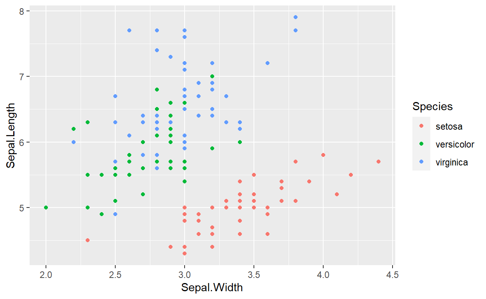

```{r child = "sections/collaborationGuide/index.md"}
```

## Captioned figures and tables

Figures and tables *with captions* can also be cross-referenced from elsewhere in your book using `\@ref(fig:chunk-label)` and `\@ref(tab:chunk-label)`, respectively.

See Figure \@ref(fig:nice-fig).

```{r nice-fig, fig.cap='Here is a nice figure!', out.width='80%', fig.asp=.75, fig.align='center', fig.alt='Plot with connected points showing that vapor pressure of mercury increases exponentially as temperature increases.'}
par(mar = c(4, 4, .1, .1))
plot(pressure, type = 'b', pch = 19)
```

Don't miss Table \@ref(tab:nice-tab).

```{r nice-tab, tidy=FALSE}
knitr::kable(
  head(pressure, 10), caption = 'Here is a nice table!',
  booktabs = TRUE
)
```

## How to do a report using RMarkdown?

Programming languages typically used by scientistics for data analysis have libraries or packages that can be used to generate reproducible reports. The most popular ones are Jupyter Notebooks for scientists who primarily use python and RMarkdown for those who use R. While they both share many commonalities, their implementation and everyday applications differ. Here, we focus on RMarkdown.

RMarkdown is a file format (typically saved with the `.Rmd` extension) that can contain: a YAML header (see next section), text, code chunks, and inline code. The `.rmarkdown` package converts this file into a report most commonly into HTML or PDF.

The `.rmarkdown` package automates a multi-step process (Fig. xx). Under the hood, it calls the `.knitr` package that converts the Rmd file into a markdown file. In the process, `.knitr` takes all the code chunks and the inline code, run them through R (or other programs), capture their output, and incorporates them in the report. Afterwards, `.rmarkdown` calls the pandoc program (it is an external program that is not related to R) that can take the markdown file and converts to a variety of formats. For pandoc to generate PDF files, you will need a functional [installation of LaTeX](https://www.latex-project.org/get/) that you will need to install separately.

The `bookdown` package comes in to take care of numbering the figures and tables, as well as dealing with citations. As its name suggests, this package can be used to author books, but it is also well-suited to help generating reports.

<!--  -->


### the YAML header

The YAML header is at the top of your file, it is delineated by three dashes (`---`) at the top and at the bottom of it. It is optional, but can be used to specify:

* the characteristics of your document: the title, authors, date of creation.
* the arguments to pass to pandoc to control the format of the output as
  well as additional information such as the bibliography file and the
  formatting of the list of references.
* parameters for your report: for instance, you can specify a parameter such that your report will only use a subset of your data so the final product will be generated quickly when you are developing the code for your project. Once your code is working, you can switch to the full dataset.


### Code chunks

Code chunks are	interspersed within the text of the report. They are delineated by three backticks (` $```$ `) at the top and at the bottom of it. The top backticks are followed by a curly bracket that specify: (1) the language in which the code chunk is written, (2) the name of the chunk (optional but good practice), (3) `knitr` options that control whether and how the code, the output, or the figure are interpreted and displayed. Everything that comes after the name of the chunk has to be a valid R expression: the strings need be quoted, the arguments are separated by commas, and logical values (`TRUE`/`FALSE`) need to be capitalized.


### How to deal with figures?

The `knitr` package provides many options to finely control how your figures are going to be generated. Some of `knitr`'s options can be set individually for each chunk or be set globally. For a reproducible report, it is common practice to have chunk at the beginning of the report that sets default options for the figures. It is also usually a good place to load all the packages you will need for your analysis. For instance the following chunk will do the following:

- all the figures generated by the report will be placed in the `figures/` sub-directory
- all the figures will be 6.5 x 4 inches and centered in the text.


```{r figuresetup, echo=FALSE, include=FALSE}
# knitr::opts_chunk$set(fig.path="figures/", fig.width=6.5,
# fig.height=4, fig.align="center")
# library(tidyverse)
```


Additionally, this chunk will be named `figuresetup`, and we use the `echo=FALSE` option so the code for the chunk will not be displayed in the report, and use the `include=FALSE` option so no output produced by this chunk will be included in the report.

For our figures, we can now do

```{r sepalwidthlength, fig.cap='Relation between sepal width and length in three species of Iris.'}
iris %>%
    ggplot(aes(x = Sepal.Width, y = Sepal.Length, color = Species)) +
    geom_point()
```

When this file will be processed, it will create an image file (`figures/sepalwidthlength.png`) with the default dimension and the caption specified by the value of the `fig.cap` argument. You can use markdown formatting within the captions of your figures. This figure will have the label `fig:sepalwidthlength` that we will be able to use for cross referencing (see below).

If you wish to incorporate a figure that is not generated by code (a photo of your field site or study organism), using the function `#knitr::include_graphics()` takes care of many details for you, and generates labels and captions as if it was generated by code.


```{r irispicture}

```

### How to deal with tables?

To generate tables, `knitr` comes with the function `kable` that might be sufficient to make simple tables to represent data frames within your report. However, there are many packages that provide more sophisticated approaches to display and format tabular data within your reports. This [page](https://hughjonesd.github.io/huxtable/design-principles.html) provides an overview of the capabilities of the different packages.


```{r iristable, eval=FALSE}
iris %>%
    group_by(Species) %>%
    summarize(sepal_length = mean(Sepal.Length),
              sepal_width = mean(Sepal.Width)) %>%
    knitr::kable(caption = "Mean sepal width and length for three species of _Iris_.")
```

<!-- Similarly to figures, when this is processed by knitr, the table will have the `tab:iristable` label that can be used for cross-referencing. -->


<!-- ### How to deal with cross-references? -->

<!-- Use the `@ref(label)` syntax. For instance -->

<!-- ``` -->
<!-- On average _setosa_ has wider and shorter sepals than the other species -->
<!-- (Fig. @ref(fig:sepalwidthlength), Table @ref(tab:iristable)). -->
<!-- ``` -->

# Sharing your book {.tabset .tabpills}

Additional resources for reference

```{r eval=FALSE}
bookdown::serve_book()
```

## Publishing

HTML books can be published online, see: https://bookdown.org/yihui/bookdown/publishing.html

## 404 pages

By default, users will be directed to a 404 page if they try to access a webpage that cannot be found. If you'd like to customize your 404 page instead of using the default, you may add either a `_404.Rmd` or `_404.md` file to your project root and use code and/or Markdown syntax.

## Metadata for sharing

Bookdown HTML books will provide HTML metadata for social sharing on platforms like Twitter, Facebook, and LinkedIn, using information you provide in the `index.Rmd` YAML. To setup, set the `url` for your book and the path to your `cover-image` file. Your book's `title` and `description` are also used.


This `gitbook` uses the same social sharing data across all chapters in your book- all links shared will look the same.

Specify your book's source repository on GitHub using the `edit` key under the configuration options in the `_output.yml` file, which allows users to suggest an edit by linking to a chapter's source file. 

Read more about the features of this output format here:

https://pkgs.rstudio.com/bookdown/reference/gitbook.html

Or use:

```{r eval=FALSE}
?bookdown::gitbook
```


